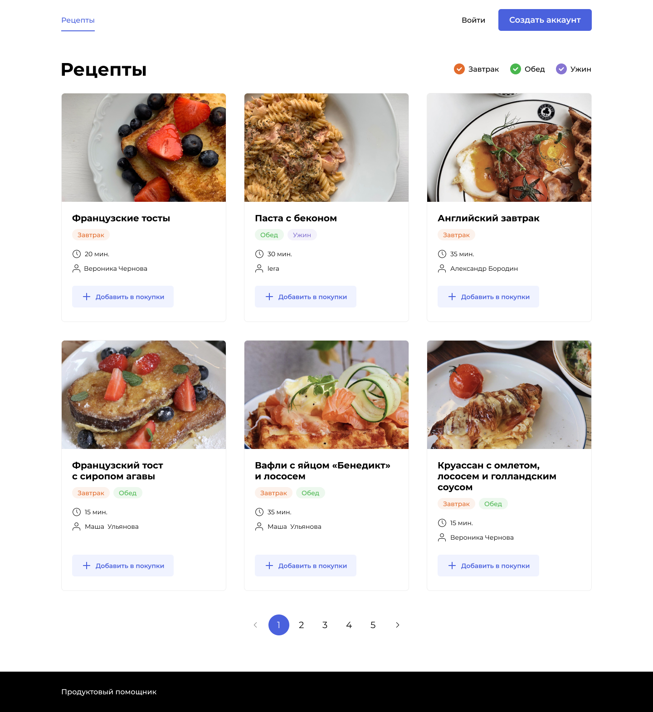
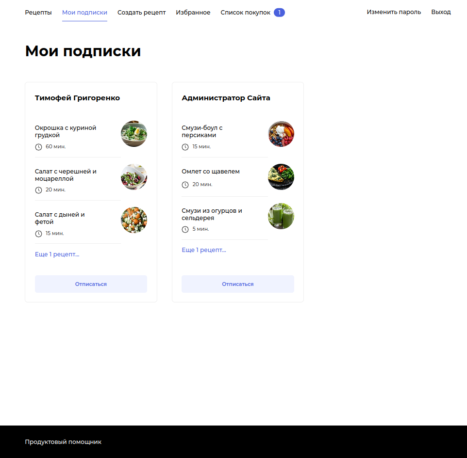

 

  
  <h3 align="center">Foodgram</h2>
  

    Продуктовый Помощник. Все ваши рецепты в одном месте!
    

    <a href="https://myfoodgram.myvnc.com/">myfoodgram.myvnc.com</a>
    ·
    <a href="https://github.com/Timofey-G/Practicum.Yandex/issues">Сообщить об ошибке</a>
    ·
    <a href="https://github.com/Timofey-G/Practicum.Yandex/pulls">Предложить улучшение</a>
  

  
Содержание

  <ol>
    <li>
      <a href="#о-проекте">О проекте</a>
      <ul>
        <li><a href="#api">API</a></li>
        <li><a href="#создано-с-использованием">Создано с использованием</a></li>
      </ul>
    </li>
    <li><a href="#вклад">Вклад</a></li>
    <li><a href="#контакты">Контакты</a></li>
  </ol>

## О проекте

  

 

Продуктовый помощник Foodgram. Платформа, в которой можно:
- Создавать, публиковать и редактировать рецепты
- Добавлять их в избранное и список покупок
- Скачивать общий список ингредиентов в pdf для всех указанных рецептов
- Просматривать контент других пользователей, подписываться на них  

  
  
  
  

 
 

Проект запущен на сервере Yandex Cloud в нескольких docker-контейнерах с помощью:  
* [![Nginx][Nginx]][Nginx-url]
* [![Gunicorn][Gunicorn]][Gunicorn-url]

Доступен по адресу [**myfoodgram.myvnc.com**](https://myfoodgram.myvnc.com/). Присоединяйтесь! :+1:  

 

(<a href="#summary">к содержанию</a>)

### API

На сайте реализован REST API, с помощью которого также можно взаимодействовать со всем функционалом.  
Полная документация доступна по ссылке: [**myfoodgram.myvnc.com/api/docs/redoc.html**](https://myfoodgram.myvnc.com/api/docs/redoc.html)
 

(<a href="#summary">к содержанию</a>)

### Создано с использованием

* [![Python][Python]][Python-url]
* [![Django][Django]][Django-url]
* [![DRF][DRF]][DRF-url]
* [![SQL][SQL]][SQL-url]
* [![Pillow][Pillow]][Pillow-url]
* [![ReportLab][ReportLab]][ReportLab-url]
* [![JS][JS]][JS-url]

(<a href="#summary">к содержанию</a>)

## Вклад

Вклады делают открытое сообщество таким замечательным местом для обучения, вдохновения и творчества. Любые ваши вклады **очень ценны**.

Если у вас есть предложение, которое сделает этот сервис лучше, пожалуйста, сделайте форк репозитория и создайте pull request. Вы также можете просто открыть проблему с тегом "enhancement". Не забудьте поставить звезду проекту! Еще раз спасибо!

1. Сделайте форк проекта
2. Создайте свою ветку функций (`git checkout -b feature/AmazingFeature`)
3. Зафиксируйте свои изменения (`git commit -m 'Add some AmazingFeature'`)
4. Запушьте в ветку (`git push origin feature/AmazingFeature`)
5. Откройте `Pull Request`

(<a href="#summary">к содержанию</a>)

## Контакты

**Тимофей Григоренко:**  

  <a href="https://t.me/yo_tima/">
      - @yo_tima
  </a>

  <a href="mailto:yotgrig@yandex.ru">
    
    - yo.tgrig@yandex.ru
  </a>

 

**Ссылка на проект:** [github.com/Timofey-G/Practicum.Yandex/tree/main/1_Foodgram](https://github.com/Timofey-G/Practicum.Yandex/tree/main/1_Foodgram)  
**Ссылка на сайт:** [myfoodgram.myvnc.com](https://myfoodgram.myvnc.com/)

(<a href="#summary">к содержанию</a>)

[Python-url]: https://python.org
[Python]: https://img.shields.io/badge/Python-3570a0?style=for-the-badge&logo=python&logoColor=ffe366
[Django-url]: https://www.djangoproject.com/
[Django]: https://img.shields.io/badge/Django-0c4b33?style=for-the-badge&logo=django&logoColor=44b78b
[DRF-url]: https://www.django-rest-framework.org/
[DRF]: https://img.shields.io/badge/Django_Rest_Framework-562d2d?style=for-the-badge&logo=django&logoColor=a30000
[SQL-url]: https://www.postgresql.org/
[SQL]: https://img.shields.io/badge/SQL-32658f?style=for-the-badge&logo=postgresql&logoColor=ffffff
[Pillow-url]: https://python-pillow.org/
[Pillow]: https://img.shields.io/badge/Pillow-3570a0?style=for-the-badge&logo=python&logoColor=ffffff
[ReportLab-url]: https://docs.reportlab.com/
[ReportLab]: https://img.shields.io/badge/ReportLab-11274e?style=for-the-badge

[JS-url]: https://www.javascript.com/
[JS]: https://img.shields.io/badge/JavaScript-fcdc00?style=for-the-badge&logo=javascript&logoColor=181818

[Nginx-url]: https://nginx.org/
[Nginx]: https://img.shields.io/badge/Nginx-298729?style=for-the-badge&logo=NGINX
[Gunicorn-url]: https://gunicorn.org/
[Gunicorn]: https://img.shields.io/badge/Gunicorn-298729?style=for-the-badge&logo=gunicorn&logoColor=ffffff
