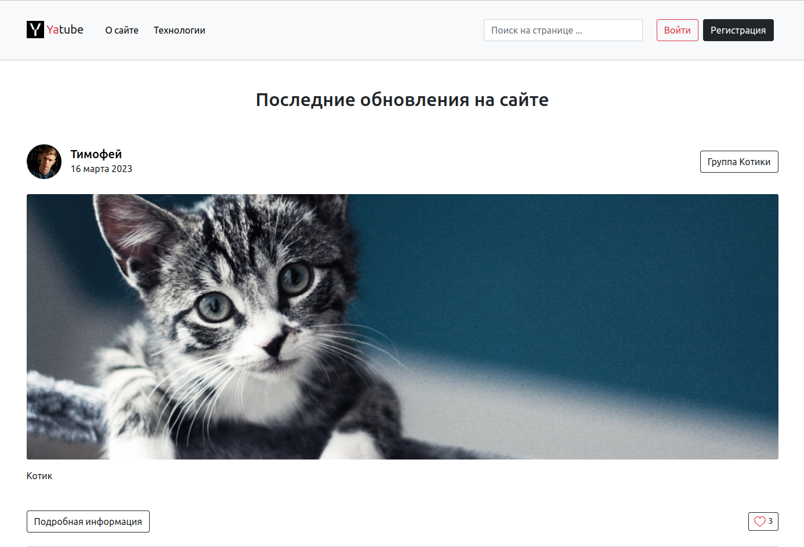

  
  <h3 align="center">Yatube</h3>
  

    Социальная сеть для всех, расскажи о себе миру!
    

    <a href="https://yatim.pythonanywhere.com/">Посмотреть Демо</a>
    ·
    <a href="https://github.com/Timofey-G/Yatube/issues">Сообщить об ошибке</a>
    ·
    <a href="https://github.com/Timofey-G/Yatube/pulls">Предложить улучшение</a>
  

  
Содержание

  <ol>
    <li>
      <a href="#о-проекте">О проекте</a>
      <ul>
        <li><a href="#создано-с-использованием">Создано с использованием</a></li>
      </ul>
    </li>
    <li>
      <a href="#начало-работы">Начало работы</a>
      <ul>
        <li><a href="#установка-и-запуск">Установка и запуск</a></li>
      </ul>
    </li>
    <li><a href="#вклад">Вклад</a></li>
    <li><a href="#контакты">Контакты</a></li>
  </ol>

## О проекте

  

 

Социальная сеть. Платформа, в которой можно:
- зарегистрироваться, добавить фото профиля
- подписываться на других пользователей, публиковать и просматривать посты, используя
фильтр по группам/пользователям/подпискам
- ставить лайки и писать комментарии, осуществлять поиск по странице, редактировать
профиль и свои записи.  

Проект покрыт тестами (Unittest), [**размещен на бесплатном хостинге**](https://yatim.pythonanywhere.com/)
и доступен для демонстрации. Присоединяйтесь! :+1:
 

Как развернуть сервис локально -
  <a href="#начало-работы"><strong>прочтите здесь</strong></a>.

(<a href="#summary">к содержанию</a>)

### Создано с использованием

* [![Python][Python]][Python-url]
* [![Django][Django]][Django-url]
* [![SQL][SQL]][SQL-url]
* [![HTML][HTML]][HTML-url]
* [![CSS][CSS]][CSS-url]
* [![Bootstrap][Bootstrap]][Bootstrap-url]
* [![Pillow][Pillow]][Pillow-url]

(<a href="#summary">к содержанию</a>)

## Начало работы

Команды в инструкции подразумевает использование операционной системы Linux.

### Установка и запуск

1. Клонируйте репозиторий и перейдите в него в командной строке:  
`git clone https://github.com/Timofey-G/Yatube.git`  
`cd Yatube`
2. Создайте и активируйте виртуальное окружение:  
`python3 -m venv env`
`source env/bin/activate`
3. Установите зависимости:  
`python -m pip install --upgrade pip`  
`pip install -r requirements.txt`
4. Создайте файл `.env`:  
`touch yatube/yatube/.env`  
`nano yatube/yatube/.env`  
в котором укажите:  
`SECRET_KEY=<ключ>`  
5. Запустите проект:  
`python yatube/manage.py runserver`
7. Готово! Сайт доступен по адресу:  
`127.0.0.1:8000`

(<a href="#summary">к содержанию</a>)

## Вклад

Вклады делают открытое сообщество таким замечательным местом для обучения, вдохновения и творчества. Любые ваши вклады **очень ценны**.

Если у вас есть предложение, которое сделает этот сервис лучше, пожалуйста, сделайте форк репозитория и создайте pull request. Вы также можете просто открыть проблему с тегом "enhancement". Не забудьте поставить звезду проекту! Еще раз спасибо!

1. Сделайте форк проекта
2. Создайте свою ветку функций (`git checkout -b feature/AmazingFeature`)
3. Зафиксируйте свои изменения (`git commit -m 'Add some AmazingFeature'`)
4. Запушьте в ветку (`git push origin feature/AmazingFeature`)
5. Откройте `Pull Request`

(<a href="#summary">к содержанию</a>)

## Контакты

**Тимофей Григоренко**  

<a href="https://t.me/yo_tima/">
    - Telegram
</a>

  
  - yo.tgrig@yandex.ru

**Ссылка на проект:** [https://github.com/Timofey-G/Yatube](https://github.com/Timofey-G/Yatube)  
**Ссылка на сайт:** [https://yatim.pythonanywhere.com/](https://yatim.pythonanywhere.com/)

(<a href="#summary">к содержанию</a>)

[Python-url]: https://python.org
[Python]: https://img.shields.io/badge/Python-3570a0?style=for-the-badge&logo=python&logoColor=ffe366
[Django-url]: https://www.djangoproject.com/
[Django]: https://img.shields.io/badge/Django-0c4b33?style=for-the-badge&logo=django&logoColor=44b78b
[Pillow-url]: https://python-pillow.org/
[Pillow]: https://img.shields.io/badge/Pillow-3570a0?style=for-the-badge&logo=python&logoColor=ffffff
[SQL-url]: https://www.sqlite.org/index.html
[SQL]: https://img.shields.io/badge/SQLite-044a64?style=for-the-badge&logo=sqlite&logoColor=ffffff

[HTML-url]: https://html.com/html5/
[HTML]: https://img.shields.io/badge/HTML-e24921?style=for-the-badge&logo=html5&logoColor=ffffff
[CSS-url]: https://html.com/css/
[CSS]: https://img.shields.io/badge/CSS-026eb9?style=for-the-badge&logo=css3&logoColor=ffffff
[Bootstrap-url]: https://getbootstrap.com/
[Bootstrap]: https://img.shields.io/badge/Bootstrap-7110f5?style=for-the-badge&logo=bootstrap&logoColor=ffffff